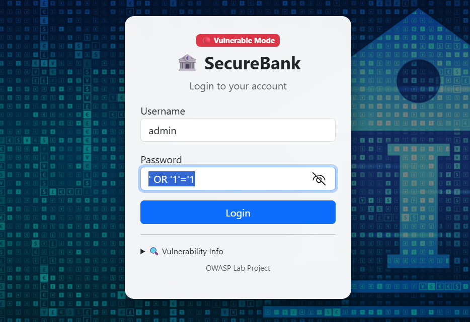
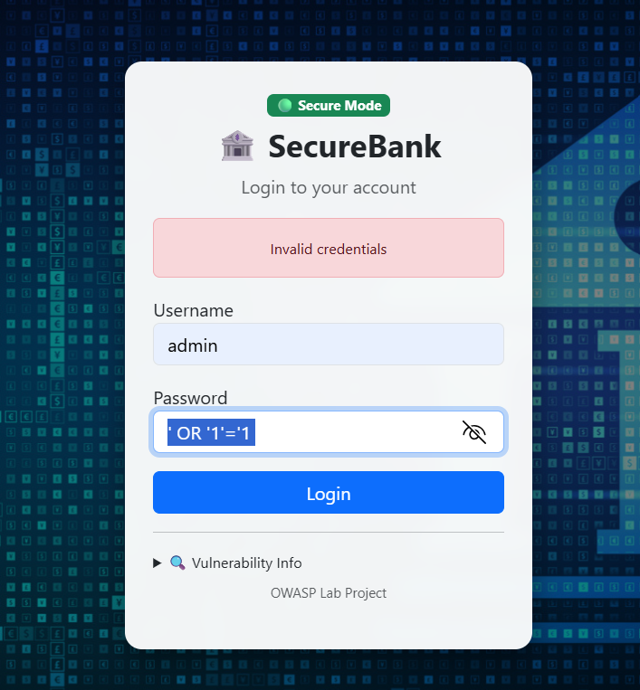
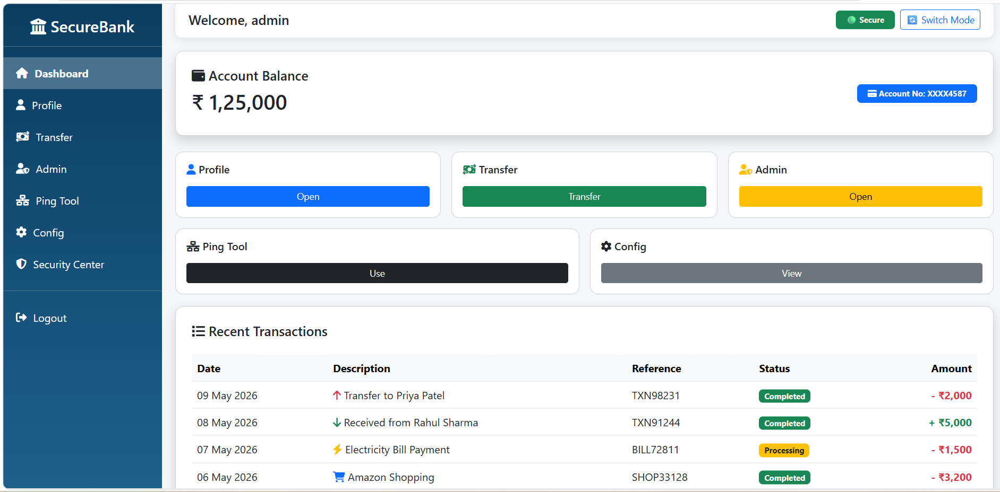
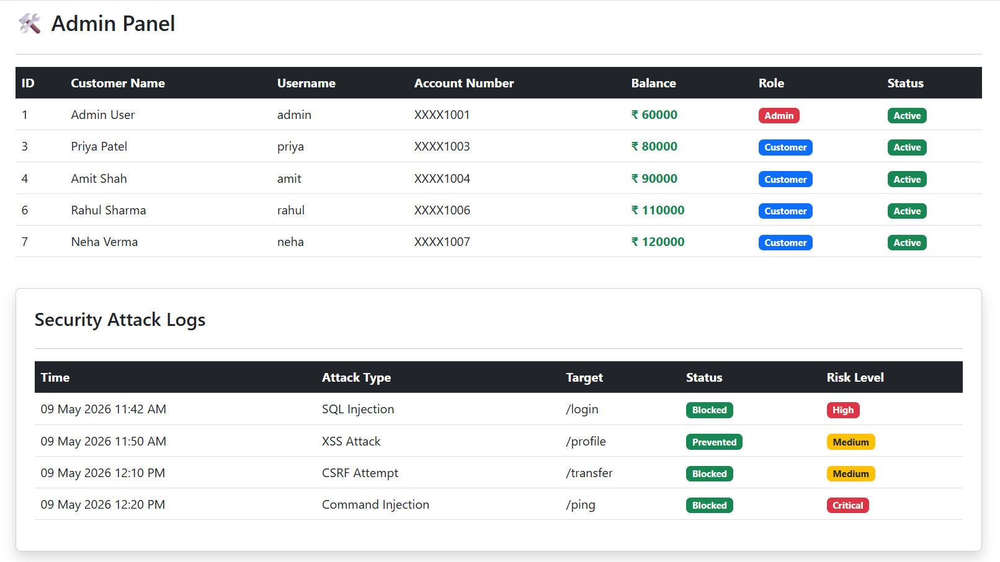

# 🏦 SecureBank Cybersecurity Lab

A professional web-based banking security lab developed using Flask and SQLite to demonstrate real-world web application vulnerabilities based on the OWASP Top 10.

This project includes both vulnerable and secure implementations of common banking features, helping students and cybersecurity learners understand how attacks work and how modern security protections prevent them.

---

# 🚀 Features

## 🔐 Authentication System
- Login & Logout
- Session Management
- Vulnerable and Secure Login Modes
- SQL Injection Demonstration

## 👤 User Profile
- Editable User Profiles
- Cross-Site Scripting (XSS) Demonstration
- IDOR / Broken Access Control Demonstration

## 💸 Banking Transactions
- Money Transfer System
- CSRF Attack Demonstration
- Secure CSRF Token Validation

## 🛡 Admin Panel
- Role-Based Access Control
- Secure vs Vulnerable Admin Access

## 🌐 Network Utility
- Ping Tool
- Command Injection Demonstration

## ⚙ Configuration Module
- Security Misconfiguration Demonstration
- Sensitive Debug Information Exposure

## 🔄 Security Mode Toggle
- Switch between:
  - 🔴 Vulnerable Mode
  - 🟢 Secure Mode

---

# 🧪 Vulnerabilities Demonstrated

| Vulnerability | Description |
|---|---|
| SQL Injection | Unsafe SQL queries allowing login bypass |
| Cross-Site Scripting (XSS) | Malicious JavaScript execution |
| CSRF | Unauthorized request execution |
| Broken Access Control | Unauthorized admin/profile access |
| Command Injection | Unsafe system command execution |
| Security Misconfiguration | Exposure of sensitive configuration data |

---

# 🛠 Technologies Used

- Python
- Flask
- SQLite3
- HTML5
- Bootstrap 5
- Jinja2
- Font Awesome

---

# 📂 Project Structure

```bash
SecureBank-Cybersecurity-Lab/
│
├── app.py
├── database.db
│
├── templates/
│   ├── login.html
│   ├── dashboard.html
│   ├── profile.html
│   ├── transfer.html
│   ├── admin.html
│   ├── ping.html
│   ├── config.html
│   └── security_center.html
│
└── README.md
```

---

# ▶ How to Run

## 1️⃣ Install Dependencies

```bash
pip install flask
```

## 2️⃣ Run Application

```bash
python app.py
```

## 3️⃣ Open Browser

```bash
http://127.0.0.1:5000
```

---

# 🔑 Demo Credentials

| Username | Password | Role |
|---|---|---|
| admin | admin123 | Administrator |
| rahul | 1234 | User |
| neha | 1234 | User |
| priya | 123 | User |
| amit | 123 | User |

---

# 🎯 Learning Objectives

- Understand real-world web vulnerabilities
- Learn secure coding practices
- Compare vulnerable vs secure implementations
- Demonstrate OWASP Top 10 attacks
- Improve cybersecurity awareness

---

# 📸 Screenshots
### 1. Vulnerable Login & SQL Injection


### 2. Secure Mode Protection


### 3. Banking Dashboard


### 4. Admin Panel


---

# ⚠ Educational Purpose Only

This project is developed strictly for:
- Educational purposes
- Cybersecurity awareness
- Ethical security testing
- Academic demonstrations

Do NOT use these techniques against real systems without authorization.

---

# 👩‍💻 Developer

Anjali Prajapati

GTU — Information Technology  
Cybersecurity & Web Security Enthusiast

---

# ⭐ Future Improvements

- Password hashing using bcrypt
- Two-Factor Authentication (2FA)
- Real transaction database
- Audit logging system
- JWT Authentication
- Docker deployment
- API security testing
- Advanced OWASP Top 10 coverage
